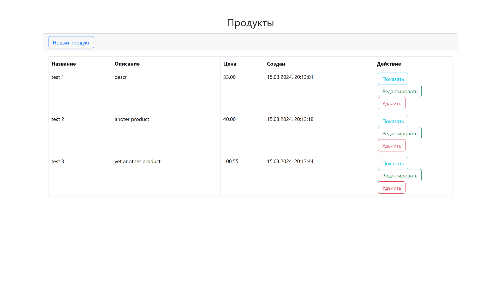
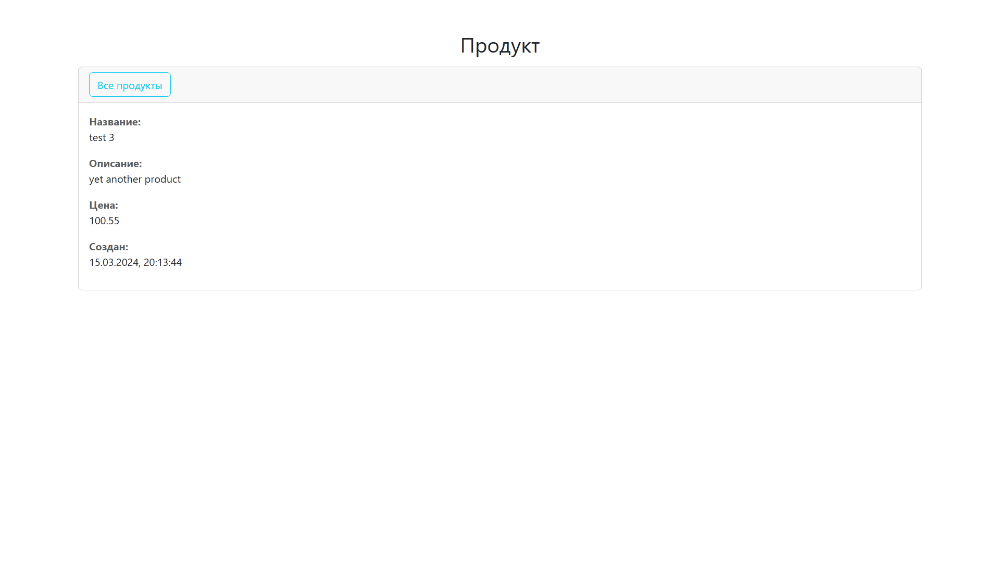
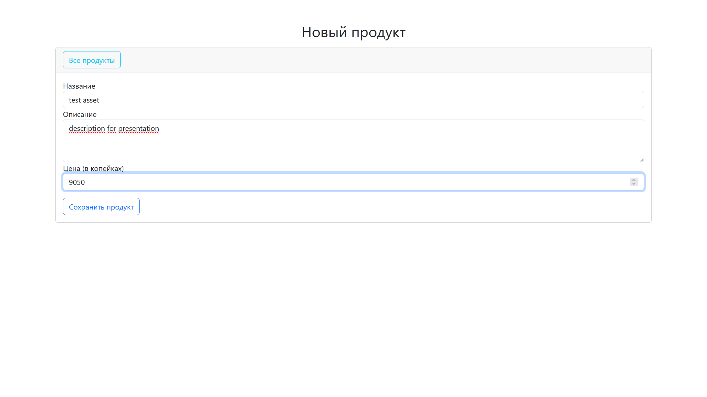
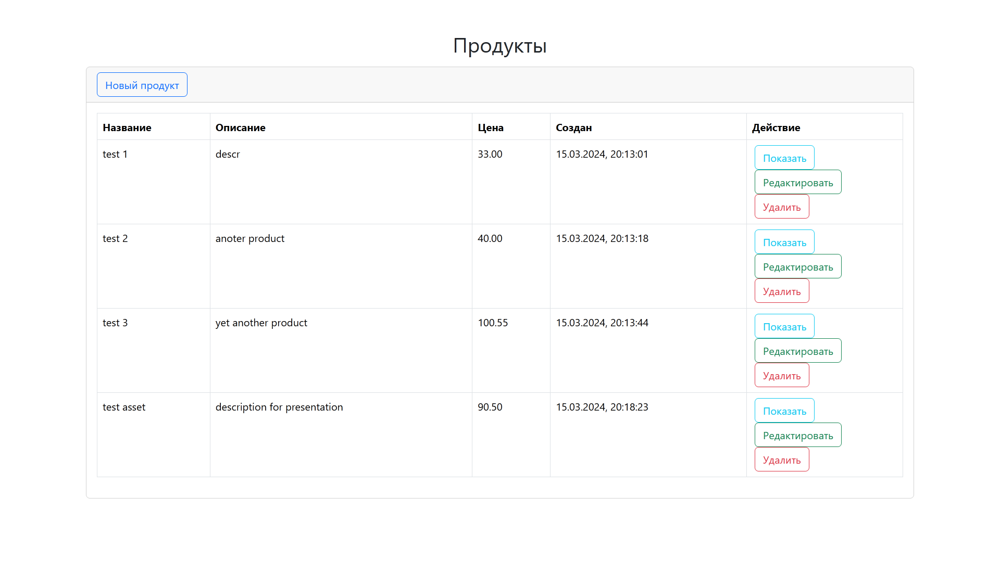
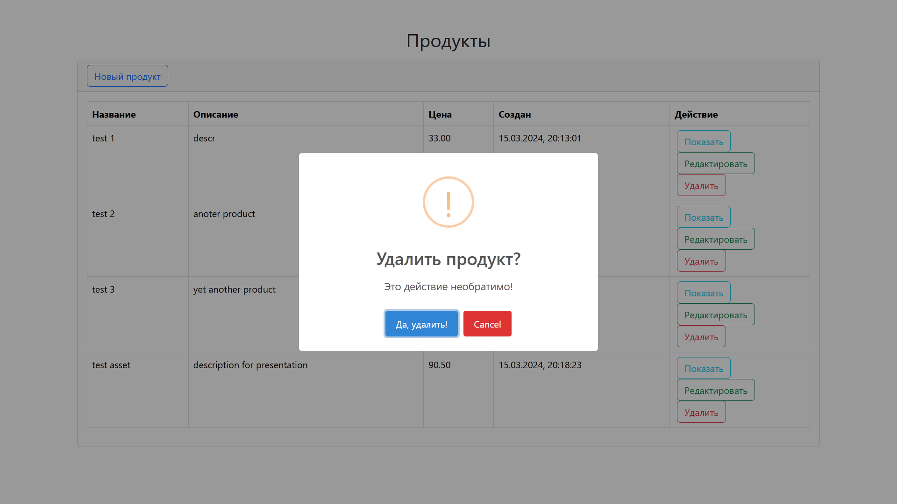
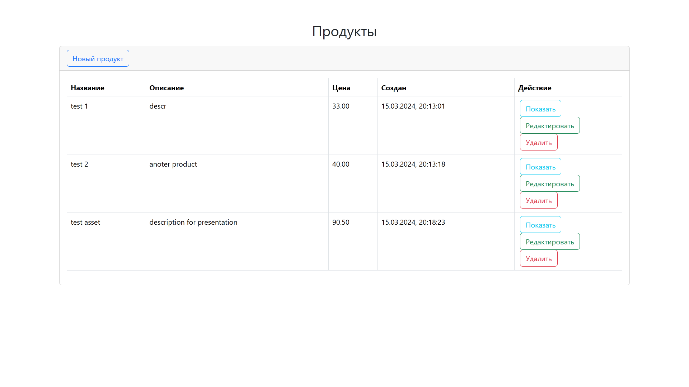
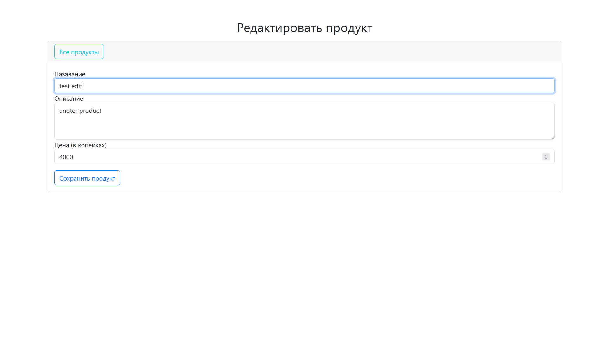
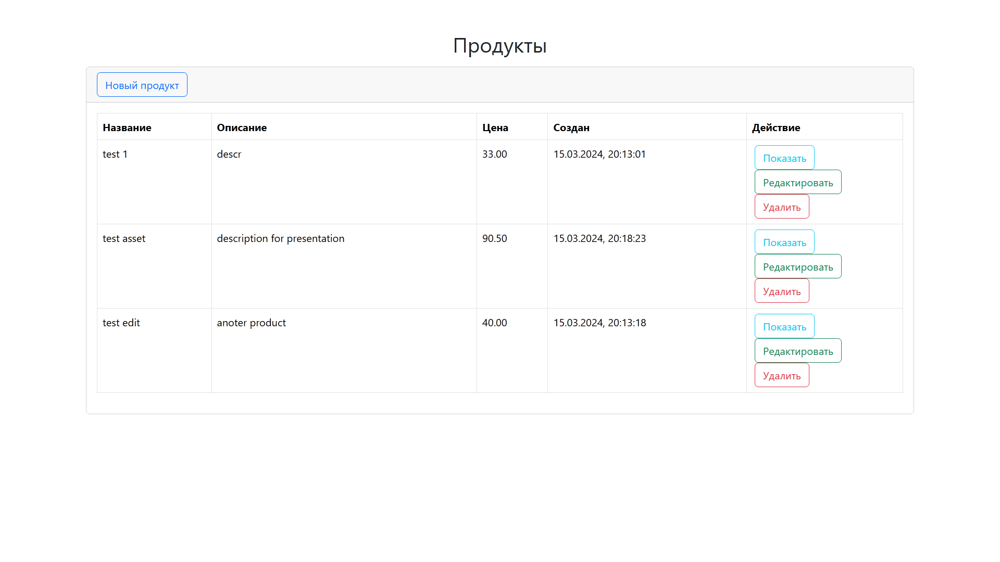

# Реализация тестового задания
> на позицию Fullstack разработчика Golang + Vue.js

## Backend
В качестве стека для backend предлагались варианты Golang + Gin/Fiber, а так же Python.
Было принято решение освоить веб-фреймворк Gin и реализовать CRUD сервис сразу на Golang,
поскольку с этим ЯП в дальнейшем предстоит работать в случае успешного прохождения тестового задания.

По итогу, были задействованы следующие сторонние библиотеки Go:
- github.com/lib/pq - драйвер для СУБД PosgtreSQL
- github.com/gin-gonic/gin - веб-фреймворк для роутинга и обработки запросов
- github.com/gin-contrib/sessions - плагин Gin для хранения состояния сессий с клиентами через cookie
- github.com/gin-contrib/cors - плагин Gin для управления CORS
- github.com/utrack/gin-csrf - плагин Gin для защиты соединения с клиентом пр CSRF-ключу

Также, в качестве ORM рассматривался [GORM](https://gorm.io/), но ввиду неоднозначных отзывов о его тонкостях, пока отложен.
На текущий момент, обращение к базе данных происходит через стандартную библиотеку (database/sql) и сырые запросы с подстановками.
Инициализация базы данных происходит автоматически при использовании Docker Compose.

# Frontend
Для создания веб-клиента было решено использовать Vue.js, по той же причине, что и Go + Gin: этот фреймворк используется в компании-заказчике. В процессе выполнения, Vue.js был освоен почти с нуля, и веб-клиент требует доработки.
В частности, необходимо реализовать пагинацию по списку продуктов.
Тем не менне, основные задачи по CRUD выполнены.

## Deploy
Приложение может быть развёрнуто как мульти-контейнер Docker. Для этого достаточно в корневом каталоге репозитория выполнить команду:
```bash
docker-compose up -d
```
*На \*nix системах может потребоваться префикс sudo*

После успешного запуска, веб-клиент приложения становится доступен из браузера по адресу [http://localhost:3000](http://localhost:3000)

## Конфигурация
Настройка может осуществляться изменением переменных окружения в файле `.env`.
В данный момент доступны следующие переменные:
- `CLIENT_PORT` - номер порта для запуска веб-клиента, по умолчанию 3000
- `SERVER_PORT` - номер порта для запуска веб-сервера, по умолчанию 3001
- `PAGE_SIZE` - размер пагинации по умолчанию на странице списка продуктов, по умолчанию 10

## Проблемы
На текущий момент не реализованы задачи авторизации по токену и генерации токенов для аутентификации.
Для решения задачи была попытка применить JWT, пользуясь плагином Gin github.com/appleboy/gin-jwt, однако, сложность внедрения оказалась сложнее предполагаемой, поэтому реализация отложена.

## API
Для сервиса был разработан RESTful API, описанный в формате OpenAPI (api/openapi.yaml).
Backend полностью поддерживает все методы и может быть протестирован напрямую без веб-клиента с помощью инструментов вроде Postman по адресу [http://localhost:3001](http://localhost:3001).

## Демонстрация

Список продуктов


Страница продукта test 3


Добавление нового продукта


Список продуктов после добавления нового продукта


Удаление продукта test 3


Список продуктов после удаления test 3


Редактирование продукта test 2


Список продуктов после редактирования test 2

